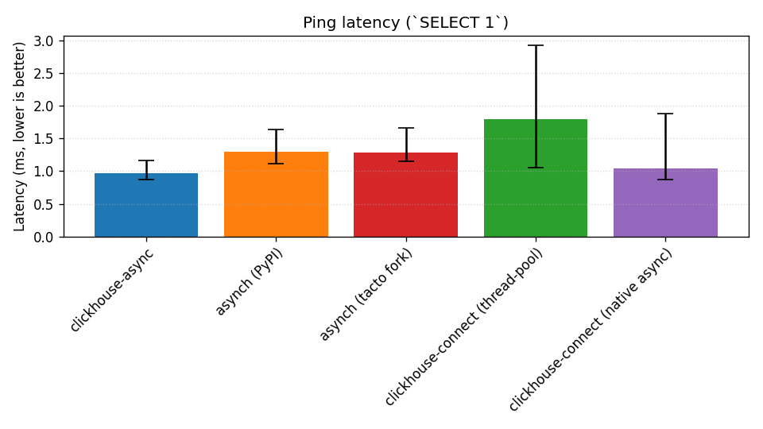
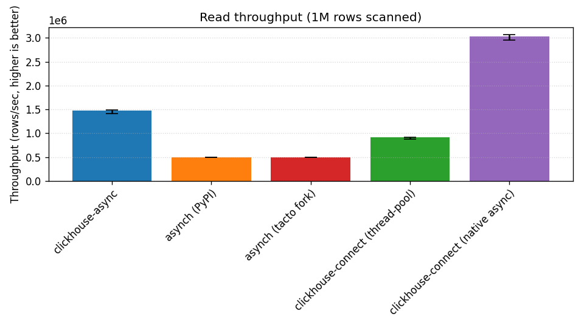
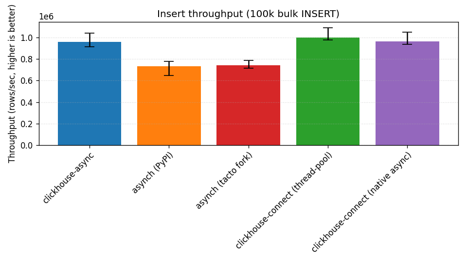
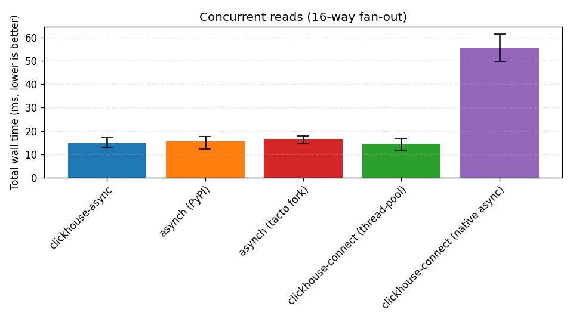
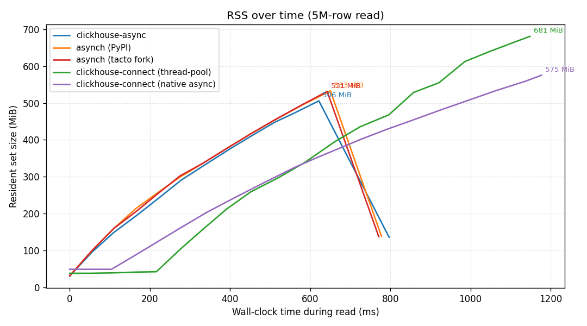

# Benchmark report
## Environment
| Field | Value |
|---|---|
| Run timestamp (UTC) | 2026-05-07T19:10:18Z |
| OS | Darwin 25.2.0 arm64 |
| CPU | Apple M3 Pro — 11P/11L cores |
| RAM | 36.0 GiB |
| Power source | n/a |
| Python | 3.14.2 |
| Docker | 29.4.0 |
| ClickHouse server | 26.3.9.8 |
| clickhouse-async | 0.4.0 |
| asynch (PyPI) | 0.3.1 |
| asynch (tacto fork) | 0.3.1 |
| clickhouse-connect (thread-pool) | 0.15.1 |
| clickhouse-connect (native async) | 1.0.0rc2 |
| Repo SHA | 73cbcd4 |
| Working tree | dirty |

## Results
### Ping latency (`SELECT 1`)

_Latency (ms, lower is better)_

| Library | n | p50 | p95 | p99 | min | max | mean |
|---|---|---|---|---|---|---|---|
| clickhouse-async | 200 | 0.969 | 1.165 | 1.304 | 0.870 | 1.405 | 0.990 |
| asynch (PyPI) | 200 | 1.298 | 1.635 | 2.064 | 1.115 | 2.377 | 1.337 |
| asynch (tacto fork) | 200 | 1.286 | 1.660 | 2.120 | 1.146 | 2.563 | 1.335 |
| clickhouse-connect (thread-pool) | 200 | 1.799 | 2.917 | 3.616 | 1.056 | 4.040 | 1.799 |
| clickhouse-connect (native async) | 200 | 1.036 | 1.884 | 2.548 | 0.873 | 3.409 | 1.157 |

### Read throughput (1M rows scanned)

_Throughput (rows/sec, higher is better)_

| Library | n | p50 | p95 | p99 | min | max | mean |
|---|---|---|---|---|---|---|---|
| clickhouse-async | 10 | 1,473,936 | 1,482,212 | 1,483,195 | 1,416,578 | 1,483,441 | 1,467,838 |
| asynch (PyPI) | 10 | 497,763 | 500,816 | 501,078 | 489,048 | 501,143 | 496,380 |
| asynch (tacto fork) | 10 | 497,373 | 499,415 | 499,883 | 489,497 | 500,000 | 496,584 |
| clickhouse-connect (thread-pool) | 10 | 909,201 | 917,332 | 918,532 | 876,486 | 918,832 | 905,859 |
| clickhouse-connect (native async) | 10 | 3,027,235 | 3,069,623 | 3,078,908 | 2,950,772 | 3,081,229 | 3,023,172 |

### Insert throughput (100k bulk INSERT)

_Throughput (rows/sec, higher is better)_

| Library | n | p50 | p95 | p99 | min | max | mean |
|---|---|---|---|---|---|---|---|
| clickhouse-async | 10 | 961,128 | 1,039,015 | 1,043,632 | 914,831 | 1,044,786 | 972,273 |
| asynch (PyPI) | 10 | 732,602 | 779,812 | 780,362 | 648,558 | 780,499 | 732,563 |
| asynch (tacto fork) | 10 | 742,792 | 787,281 | 787,652 | 712,877 | 787,744 | 747,268 |
| clickhouse-connect (thread-pool) | 10 | 999,219 | 1,090,946 | 1,094,162 | 975,925 | 1,094,966 | 1,019,644 |
| clickhouse-connect (native async) | 10 | 964,856 | 1,051,231 | 1,053,546 | 935,095 | 1,054,124 | 985,216 |

### Concurrent reads (16-way fan-out)

_Total wall time (ms, lower is better)_

| Library | n | p50 | p95 | p99 | min | max | mean |
|---|---|---|---|---|---|---|---|
| clickhouse-async | 10 | 14.712 | 17.115 | 17.519 | 12.763 | 17.620 | 14.883 |
| asynch (PyPI) | 10 | 15.486 | 17.557 | 17.879 | 12.314 | 17.960 | 15.371 |
| asynch (tacto fork) | 10 | 16.463 | 17.848 | 18.151 | 14.717 | 18.227 | 16.387 |
| clickhouse-connect (thread-pool) | 10 | 14.441 | 16.824 | 17.293 | 11.772 | 17.410 | 14.288 |
| clickhouse-connect (native async) | 10 | 55.560 | 61.508 | 62.794 | 49.767 | 63.116 | 55.817 |

### RSS over time (5M-row read)

_Resident set size (MiB) over wall-clock time (ms)_

| Library | n | p50 | p95 | p99 | min | max | mean |
|---|---|---|---|---|---|---|---|
| clickhouse-async | 1 | 505.8 | 505.8 | 505.8 | 505.8 | 505.8 | 505.8 |
| asynch (PyPI) | 1 | 532.9 | 532.9 | 532.9 | 532.9 | 532.9 | 532.9 |
| asynch (tacto fork) | 1 | 531.4 | 531.4 | 531.4 | 531.4 | 531.4 | 531.4 |
| clickhouse-connect (thread-pool) | 1 | 681.0 | 681.0 | 681.0 | 681.0 | 681.0 | 681.0 |
| clickhouse-connect (native async) | 1 | 575.2 | 575.2 | 575.2 | 575.2 | 575.2 | 575.2 |

